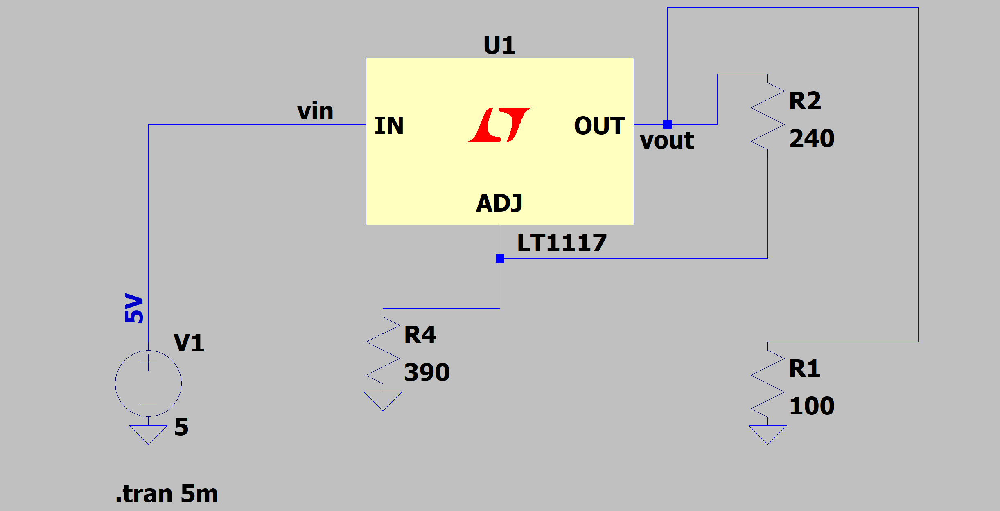
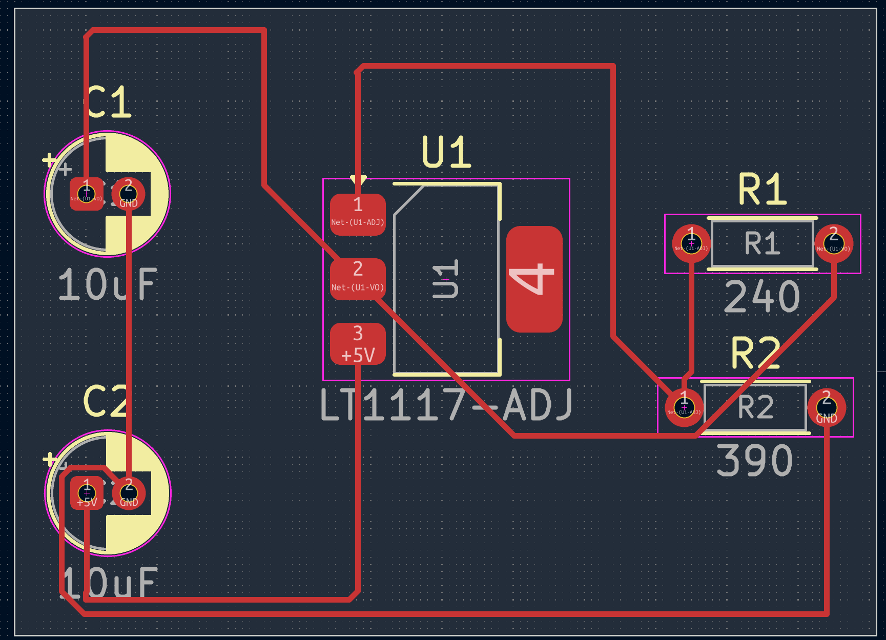
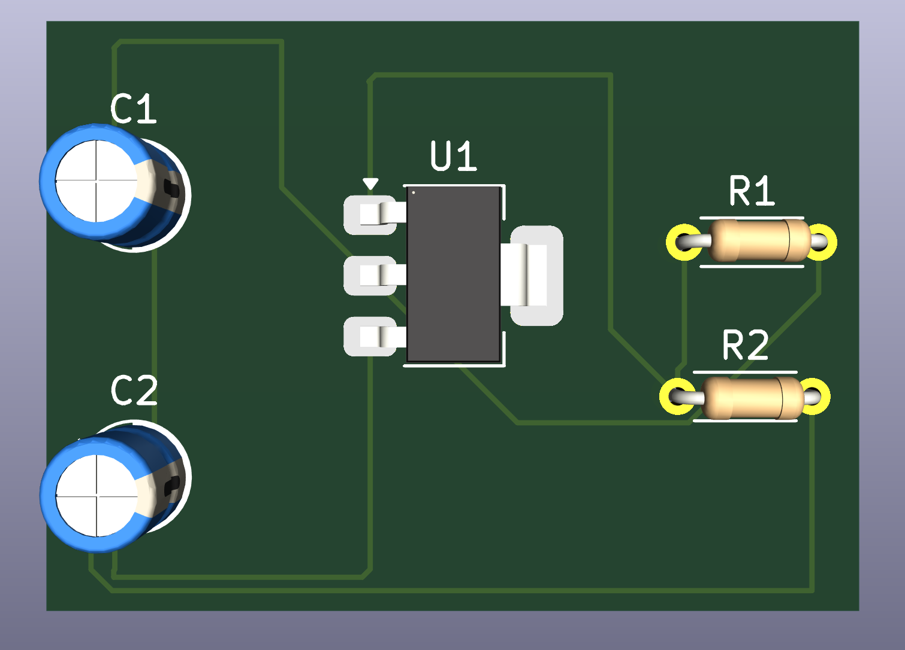

# 5V - 3.3V Voltage Regulator Board (LT1117-ADJ)

This repository contains the hardware files for a simple and stable 5V-to-3.3V step-down voltage regulator circuit, designed using KiCad.

## Hardware Details
The circuit is built around the LT1117-ADJ adjustable voltage regulator. The desired 3.3V output voltage is achieved using a voltage divider network formed by R1 (240Ω) and R2 (390Ω). Filter capacitors are used on both the input and output stages to suppress power line ripple and improve stability.

## Technical Specifications
* **Input:** 5V
* **Output:** 3.3V
* **Software Used:** KiCad EDA

## Bill of Materials (BOM)
| Reference | Component | Value | Footprint |
| :--- | :--- | :--- | :--- |
| U1 | Regulator | LT1117-ADJ | SOT-223-3 (SMD) |
| R1 | Resistor | 240Ω | Standard THT (Axial) |
| R2 | Resistor | 390Ω | Standard THT (Axial) |
| C1, C2 | Capacitor | 10uF | Polarized THT (Radial) |

## Screenshots

### Schematic

### PCB Layout

### 3D View

